### Development Setup

1. Fork the repository
2. Clone your fork:
   ```bash
   git clone https://github.com/thuongtruong109/reluster.git
   ```
3. Make changes
4. Run tests:
   ```bash
   make ha-test
   ```
5. Submit a pull request

## 📈 Dependency Graph

```mermaid
graph LR
    subgraph Replica_HA_Sentinel
        commander[commander]
        ha[ha]
        ha-master[ha-master]
        ha-slave[ha-slave]
        ha-test-failover[ha-test-failover]
        ha-bench[ha-bench]
        ha-backup[ha-backup]
        ha-health[ha-health]
        ha-ready[ha-ready]
        ha-scan[ha-scan]
        ha-cli[ha-cli]
    end

    subgraph Cluster_Sharding
        clt[clt]
        clt-init[clt-init]
        clt-ready[clt-ready]
        clt-monitor[clt-monitor]
        clt-scan[clt-scan]
        clt-test[clt-test]
        clt-bench[clt-bench]
        clt-rollback[clt-rollback]
        clt-scale[clt-scale]
        clt-health[clt-health]
        clt-cli[clt-cli]
    end

    %% Example dependencies (bạn có thể bổ sung thêm nếu muốn)
    ha --> ha-master
    ha --> ha-slave
    ha --> ha-test-failover
    ha --> ha-bench
    ha --> ha-backup
    ha --> ha-health
    ha --> ha-ready
    ha --> ha-scan
    ha --> ha-cli

    clt --> clt-init
    clt-init --> clt-ready
    clt-ready --> clt-monitor
    clt-ready --> clt-scan
    clt-ready --> clt-test
    clt-ready --> clt-bench
    clt-ready --> clt-rollback
    clt-ready --> clt-scale
    clt-ready --> clt-health
    clt-ready --> clt-cli
```



## 📁 Project Structure

```
reluster/
├── docker-compose.ha.yml         # Sentinel/HA setup (master, replicas, sentinels, commander)
├── docker-compose.cluster.yml    # Redis Cluster (6 nodes + RedisInsight)
├── Makefile                      # Automation commands
├── README.md                     # Main documentation
├── LICENSE                       # Apache 2.0 License
├── todo.md                       # Roadmap / Future enhancements
├── backups/                      # Backup storage
│   ├── dump.rdb
│   └── dump_YYYY-MM-DD_HH-MM-SS.rdb
├── commander/
│   └── ha.json                   # Redis Commander config
├── ha/
│   ├── master.conf               # Master Redis config
│   ├── sentinel.conf             # Sentinel config
│   └── slave.conf                # Replica Redis config
├── cluster/
│   └── node.conf                 # Cluster node config
├── scripts/
│   ├── ha-backup.sh              # Backup & restore script
│   └── ha-health.sh              # Health check script
└── tests/
    ├── ha-failover.sh            # Sentinel failover test
    ├── ha.sh                     # HA integration test
    └── clt.sh                    # Cluster test
```

## ⚡ Quick Start

### 1️⃣ Sentinel Mode (HA, failover)

```bash
# Start Sentinel/replica/master/commander
docker-compose -f docker-compose.ha.yml up -d
```

### 2️⃣ Cluster Mode (Sharding + Replication)

```bash
# Start 6 Redis nodes + RedisInsight
docker-compose -f docker-compose.cluster.yml up -d

# Create cluster (run once):
# (see Makefile or scripts for cluster creation)
```

## 🛡️ Sentinel Mode

- **Master:** `redis-master` (port 6379, password: `masterpass`)
- **Replicas:** `slave_1` (6380), `slave_2` (6381), `slave_3` (6382)
- **Sentinels:** `sentinel_1` (26379), `sentinel_2` (26380), `sentinel_3` (26381)
- **Redis Commander:** [http://localhost:8081](http://localhost:8081)

### 🔑 Access Redis

```bash
docker exec -it redis-master redis-cli -a masterpass
docker exec -it slave_1 redis-cli -a masterpass
docker exec -it sentinel_1 redis-cli -p 26379 SENTINEL get-master-addr-by-name mymaster
```

## 🗃️ Cluster Mode

- **Nodes:** `node-1` ... `node-6` (ports 7001-7006)
- **RedisInsight:** [http://localhost:8001](http://localhost:8001)

### 🛠️ Create Cluster

```bash
# See Makefile or scripts for cluster creation
```

## 🔄 Failover Test (Sentinel)

You can use the provided script to simulate failover:

```bash
# On Linux/WSL/Git Bash:
chmod +x tests/ha-failover.sh
./tests/ha-failover.sh

# On PowerShell:
# (Manual steps below)
```

Or run manually:

1. **Check current master:**
   ```bash
   docker exec -it sentinel_1 redis-cli -p 26379 SENTINEL get-master-addr-by-name mymaster
   ```
2. **Stop master:**
   ```bash
   docker stop redis-master
   ```
3. **Check new master:**
   ```bash
   docker exec -it sentinel_1 redis-cli -p 26379 SENTINEL get-master-addr-by-name mymaster
   ```
4. **Check replica role:**
   ```bash
   docker exec -it slave_1 redis-cli -a masterpass INFO replication | grep role
   ```
5. **Restart old master:**
   ```bash
   docker start redis-master
   ```

## 🧰 Troubleshooting: Line Endings

If you see errors with config files (especially on Windows), ensure files use **LF** (not CRLF) endings.

⚠️ Windows CRLF Issue
Ensure configs use LF endings.

### On Git Bash / WSL / Linux:

```bash
dos2unix ha/sentinel.conf ha/master.conf ha/slave.conf
sed -i 's/\r$//' ha/sentinel.conf ha/master.conf ha/slave.conf
```

### On PowerShell:

Or use Notepad++: Edit → EOL Conversion → Unix (LF) → Save.

### With Tab/Spaces Issues:

## 🏷️ Useful Commands

```bash
# Check network
docker network inspect redisnet

# Check container status
docker ps -a --format "table {{.Names}}\t{{.Status}}"

# View logs
docker-compose -f docker-compose.ha.yml logs -f sentinel_1

# Access Redis Commander
start http://localhost:8081

start http://localhost:8001
```

- **Extend:** Add your own application containers to test integration with Redis.

## 🛠️ Scripts and Automation

This project includes several automation scripts to help with management and testing:

### Health Checks (`scripts/ha-health.sh`)

Comprehensive health monitoring for the Redis cluster:

````bash
# Basic health check

# Full health check with metrics

# Load testing

# Generate health report
./scripts/ha-health.sh --report

Features:

- Container status monitoring
- Redis connectivity tests
- Memory usage tracking
- Automated reporting

### Backup & Restore (`scripts/ha-backup.sh`)
Automated backup and restore functionality:
```bash
./scripts/ha-backup.sh

# Restore from latest backup
````

Features:

- Automatic RDB file backup
- Restore verification
- Cleanup of old backups (7+ days)

# Run automated failover test

./tests/ha-failover.sh

````

Simulates master failure and verifies automatic failover to replica.

### Integration Tests (`tests/ha.sh`)

Comprehensive integration testing:

```bash
# Run full integration test suite
./tests/ha.sh
````

Tests:

- Service startup and readiness
- Master-slave replication
- Automatic failover
- Data consistency
- Recovery procedures

### Cluster Tests (`tests/clt.sh`)

Test Redis Cluster functionality:

```bash
# Run cluster test suite
./tests/clt.sh
```

## 📋 Makefile

Use the provided Makefile for common operations:

```bash
# Format configuration files (fix line endings)
make format

# Start Sentinel/HA cluster
make ha

# Get current master
make ha-master

# Get slave info
make ha-slave

# Run failover test
make ha-test-failover

# Run integration tests
make ha-test

# Run backup
make ha-backup

# Run health checks
make ha-health

# Start Redis Cluster
make clt

# Create cluster
make clt-create

# Check cluster status
make clt-check

# Run cluster tests
make clt-test
```
