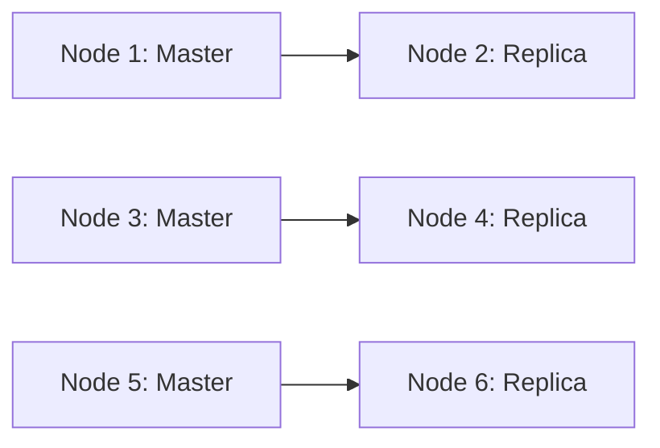

<div align="center">
  <p>
    
    
    
    
    
   
  </p>

   

   <p><b>A complete, ready-to-run Redis Sentinel & Cluster environment with Docker Compose for learning, testing, and deploying Redis in real-world scenarios.</b></p>
</div>

## 📝 Overview

This project provides a **comprehensive Redis playground** for:

- ⚡ **Redis Sentinel** → High Availability & Automatic Failover
- 📦 **Redis Cluster** → Sharding + High Availability

🎯 **Goal**: Help developers, DevOps, and students **experiment, validate, monitor, and integrate Redis** into real-world systems.

## ✨ Features

- ✅ **Quick Bootstrap** – Start Sentinel & Cluster modes in seconds with Docker Compose
- ✅ **Automation Scripts** – Health checks, failover, backup, slot rebalancing, performance tests
- ✅ **Monitoring Tools** – RedisInsight, Redis Commander, Prometheus, Grafana, Alerts (Slack/Email/Telegram)
- ✅ **CI/CD Ready** – GitHub Actions/GitLab CI for automated testing & deployment
- ✅ **Real-World Demos** – Integration with Node.js, Python, Java, etc. (caching, pub/sub, queues, sessions)
- ✅ **Advanced Guides** – Kubernetes (Helm, StatefulSet, Operator), Cloud Backup/Restore, Security

## 👤 Who Is This For?

- 👨‍💻 **Backend Devs** – Learn caching, pub/sub, queues
- 🛠️ **DevOps/SREs** – Practice HA, failover, and monitoring
- 🎓 **Students/Learners** – Hands-on Redis environment for study
- 🏗️ **Architects** – Validate Redis integration into distributed systems

## 🏗️ Architecture

### 🔹 Sentinel Mode (HA, Failover)

```mermaid
flowchart TD
   S1[Sentinel 1]
   S2[Sentinel 2]
   S3[Sentinel 3]
   M[Master (6379)]
   R1[Replica 1 (6380)]
   R2[Replica 2 (6381)]
   S1 --> M
   S2 --> M
   S3 --> M
   M --> R1
   M --> R2
```

### 🔹 Cluster Mode (Sharding)



## 🤝 Contributing

We welcome contributions! Please see our [Contributing Guidelines](.github/CONTRIBUTING.md) for details.

💡 Fork → Hack → Test → PR.
Bug reports & feature requests welcome in [Issues](https://github.com/thuongtruong109/redis-cluster/issues).

### Issue Templates

- [Bug Report](.github/ISSUE_TEMPLATE/bug-report.yml)
- [Feature Request](.github/ISSUE_TEMPLATE/feature-request.yml)

## 📝 License

[Apache 2.0](LICENSE)

<!-- https://medium.com/@jielim36/basic-docker-compose-and-build-a-redis-cluster-with-docker-compose-0313f063afb6 -->
<!-- https://dev.to/hedgehog/set-up-redis-diskless-replication-359 -->
<!--  -->
