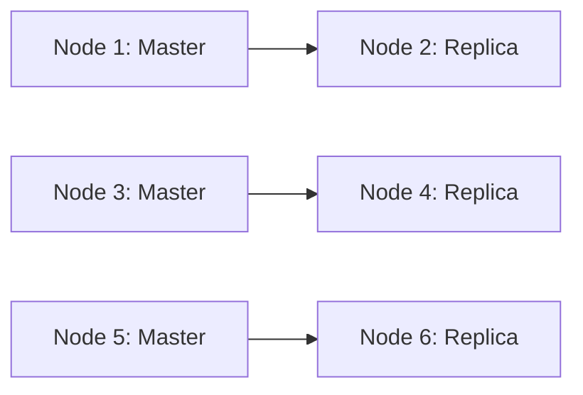

<div align="center">
  <p>
    
    
    
    
    
   
  </p>

   

   <p><b>A complete, ready-to-run Redis Sentinel & Cluster environment with Docker Compose for learning, testing, and deploying Redis in real-world scenarios.</b></p>

  <!--  -->
</div>

## 📝 Overview

This project provides a **comprehensive Redis playground** for:

- ⚡ **Redis Sentinel** → High Availability & Automatic Failover
- 📦 **Redis Cluster** → Sharding + High Availability

🎯 **Goal**: Help developers, DevOps, and students **experiment, validate, monitor, and integrate Redis** into real-world systems.

## ✨ Features

- ✅ **Quick Bootstrap** – Start Sentinel & Cluster modes in seconds with Docker Compose
- ✅ **Automation Scripts** – Health checks, failover, backup, slot rebalancing, performance tests
- ✅ **Monitoring Tools** – RedisInsight, Redis Commander, Prometheus, Grafana, Alerts (Slack/Email/Telegram)
- ✅ **CI/CD Ready** – GitHub Actions/GitLab CI for automated testing & deployment
- ✅ **Real-World Demos** – Integration with Node.js, Python, Java, etc. (caching, pub/sub, queues, sessions)
- ✅ **Advanced Guides** – Kubernetes (Helm, StatefulSet, Operator), Cloud Backup/Restore, Security

## 👤 Who Is This For?

- 👨‍💻 **Backend Devs** – Learn caching, pub/sub, queues
- 🛠️ **DevOps/SREs** – Practice HA, failover, and monitoring
- 🎓 **Students/Learners** – Hands-on Redis environment for study
- 🏗️ **Architects** – Validate Redis integration into distributed systems

## 📁 Project Structure

```
reluster/
├── docker-compose.ha.yml         # Sentinel/HA setup (master, slaves, sentinels, commander)
├── docker-compose.cluster.yml    # Redis Cluster (6 nodes + RedisInsight)
├── Makefile                      # Automation commands
├── README.md                     # This file
├── LICENSE                       # Apache 2.0 License
├── todo.md                       # Future enhancements roadmap
├── backups/                      # Backup storage directory
│   ├── dump.rdb                  # Current backup
│   └── dump_YYYY-MM-DD_HH-MM-SS.rdb  # Timestamped backups
├── commander/
│   └── ha.json                   # Redis Commander configuration
├── ha/
│   ├── master.conf               # Master Redis configuration
│   ├── sentinel.conf             # Sentinel configuration
│   └── slave.conf                # Slave Redis configuration
├── cluster/
│   └── node.conf                 # Cluster node configuration
├── scripts/
│   ├── ha-backup.sh              # Backup and restore script
│   └── ha-health.sh              # Health check script
└── tests/
   ├── ha-failover.sh            # Failover test script
   ├── ha.sh                     # Integration test script
   └── clt.sh                    # Cluster test script
```

## 🏗️ Architecture

### 🔹 Sentinel Mode (HA, Failover)

```mermaid
flowchart TD
   S1[Sentinel 1] --> M[Master (6379)]
   S2[Sentinel 2] --> M
   S3[Sentinel 3] --> M
   M --> R1[Replica 1 (6380)]
   M --> R2[Replica 2 (6381)]
```

### 🔹 Cluster Mode (Sharding)



## ⚡ Quick Start

### 1️⃣ Sentinel Mode (HA, failover)

```bash
# Start Sentinel/replica/master/commander
docker-compose -f docker-compose.ha.yml up -d
```

### 2️⃣ Cluster Mode (sharding, failover)

```bash
# Start 6 Redis nodes + RedisInsight
docker-compose -f docker-compose.cluster.yml up -d

# Create cluster (run once):
# (see Makefile or scripts for cluster creation)
```

## 🛡️ Sentinel Mode

- **Master:** `redis-master` (port 6379, password: `masterpass`)
- **Replicas:** `slave_1` (6380), `slave_2` (6381), `slave_3` (6382)
- **Sentinels:** `sentinel_1` (26379), `sentinel_2` (26380), `sentinel_3` (26381)
- **Redis Commander:** [http://localhost:8081](http://localhost:8081)

### 🔑 Access Redis

```bash
docker exec -it redis-master redis-cli -a masterpass
docker exec -it slave_1 redis-cli -a masterpass
docker exec -it sentinel_1 redis-cli -p 26379 SENTINEL get-master-addr-by-name mymaster
```

## 🗃️ Cluster Mode

- **Nodes:** `node-1` ... `node-6` (ports 7001-7006)
- **RedisInsight:** [http://localhost:8001](http://localhost:8001)

### 🛠️ Create Cluster

```bash
# See Makefile or scripts for cluster creation
```

## 🔄 Failover Test (Sentinel)

You can use the provided script to simulate failover:

```bash
# On Linux/WSL/Git Bash:
chmod +x tests/ha-failover.sh
./tests/ha-failover.sh

# On PowerShell:
# (Manual steps below)
```

Or run manually:

1. **Check current master:**
   ```bash
   docker exec -it sentinel_1 redis-cli -p 26379 SENTINEL get-master-addr-by-name mymaster
   ```
2. **Stop master:**
   ```bash
   docker stop redis-master
   ```
3. **Check new master:**
   ```bash
   docker exec -it sentinel_1 redis-cli -p 26379 SENTINEL get-master-addr-by-name mymaster
   ```
4. **Check replica role:**
   ```bash
   docker exec -it slave_1 redis-cli -a masterpass INFO replication | grep role
   ```
5. **Restart old master:**
   ```bash
   docker start redis-master
   ```

## 🧰 Troubleshooting: Line Endings

If you see errors with config files (especially on Windows), ensure files use **LF** (not CRLF) endings.

⚠️ Windows CRLF Issue
Ensure configs use LF endings.

### On Git Bash / WSL / Linux:

```bash
dos2unix ha/sentinel.conf ha/master.conf ha/slave.conf
sed -i 's/\r$//' ha/sentinel.conf ha/master.conf ha/slave.conf
```

### On PowerShell:

```powershell
(Get-Content ha/sentinel.conf -Raw) -replace "`r`n","`n" | Set-Content ha/sentinel.conf -NoNewline
(Get-Content ha/master.conf -Raw) -replace "`r`n","`n" | Set-Content ha/master.conf -NoNewline
(Get-Content ha/slave.conf -Raw) -replace "`r`n","`n" | Set-Content ha/slave.conf -NoNewline
```

Or use Notepad++: Edit → EOL Conversion → Unix (LF) → Save.

### With Tab/Spaces Issues:

> Tip: In VS Code, you can use Ctrl+Shift+P → "Convert Indentation to Tabs" to fix all lines.

## 🏷️ Useful Commands

```bash
# Check network
docker network inspect redisnet

# Check container status
docker ps -a --format "table {{.Names}}\t{{.Status}}"

# View logs
docker-compose -f docker-compose.ha.yml logs -f sentinel_1

# Access Redis Commander
start http://localhost:8081

# Access RedisInsight
start http://localhost:8001
```

## 📢 Tips

- **Windows users:** Prefer WSL or Git Bash for scripts. For PowerShell, use manual steps.
- **Security:** Change default passwords before using in production.
- **Extend:** Add your own application containers to test integration with Redis.

## 🛠️ Scripts and Automation

This project includes several automation scripts to help with management and testing:

### Health Checks (`scripts/ha-health.sh`)

Comprehensive health monitoring for the Redis cluster:

```bash
# Basic health check
./scripts/ha-health.sh --basic

# Full health check with metrics
./scripts/ha-health.sh --full

# Load testing
./scripts/ha-health.sh --load-test

# Generate health report
./scripts/ha-health.sh --report
```

Features:

- Container status monitoring
- Redis connectivity tests
- Replication verification
- Sentinel status checks
- Memory usage tracking
- Performance benchmarking
- Automated reporting

### Backup & Restore (`scripts/ha-backup.sh`)

Automated backup and restore functionality:

```bash
# Run backup (creates timestamped RDB file in backups/)
./scripts/ha-backup.sh

# Restore from latest backup
# (Script handles loading RDB into new container for verification)
```

Features:

- Automatic RDB file backup
- Timestamped backup files
- Restore verification
- Cleanup of old backups (7+ days)

## 🧪 Testing

### Failover Tests (`tests/ha-failover.sh`)

Test Sentinel failover functionality:

```bash
# Run automated failover test
./tests/ha-failover.sh
```

Simulates master failure and verifies automatic failover to replica.

### Integration Tests (`tests/ha.sh`)

Comprehensive integration testing:

```bash
# Run full integration test suite
./tests/ha.sh
```

Tests:

- Service startup and readiness
- Master-slave replication
- Automatic failover
- Data consistency
- Recovery procedures

### Cluster Tests (`tests/clt.sh`)

Test Redis Cluster functionality:

```bash
# Run cluster test suite
./tests/clt.sh
```

## 📋 Makefile

Use the provided Makefile for common operations:

```bash
# Format configuration files (fix line endings)
make format

# Start Sentinel/HA cluster
make ha

# Get current master
make ha-master

# Get slave info
make ha-slave

# Run failover test
make ha-test-failover

# Run integration tests
make ha-test

# Run backup
make ha-backup

# Run health checks
make ha-health

# Start Redis Cluster
make clt

# Create cluster
make clt-create

# Check cluster status
make clt-check

# Run cluster tests
make clt-test
```

## 🤝 Contributing

We welcome contributions! Please see our [Contributing Guidelines](.github/CONTRIBUTING.md) for details.

💡 Fork → Hack → Test → PR.
Bug reports & feature requests welcome in [Issues](https://github.com/thuongtruong109/redis-cluster/issues).

### Development Setup

1. Fork the repository
2. Clone your fork: `git clone https://github.com/thuongtruong109/redis-cluster.git`
3. Make changes
4. Run tests: `make ha-test`
5. Submit a pull request

### Issue Templates

- [Bug Report](.github/ISSUE_TEMPLATE/bug-report.yml)
- [Feature Request](.github/ISSUE_TEMPLATE/feature-request.yml)

## 📝 License

[Apache 2.0](LICENSE)

<!-- https://medium.com/@jielim36/basic-docker-compose-and-build-a-redis-cluster-with-docker-compose-0313f063afb6 -->
<!-- https://dev.to/hedgehog/set-up-redis-diskless-replication-359 -->
