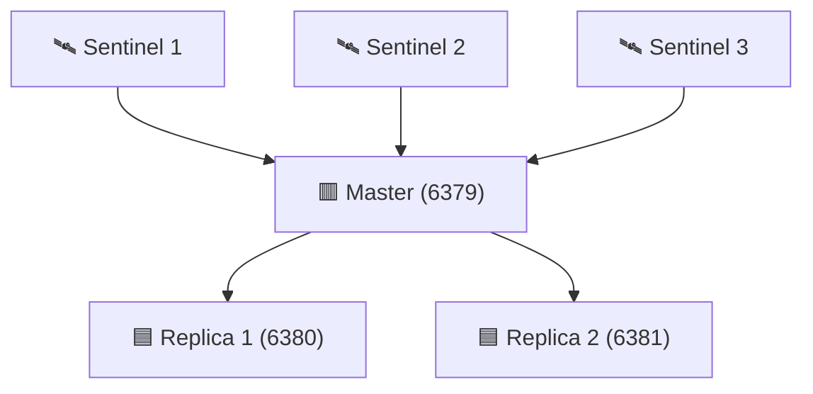
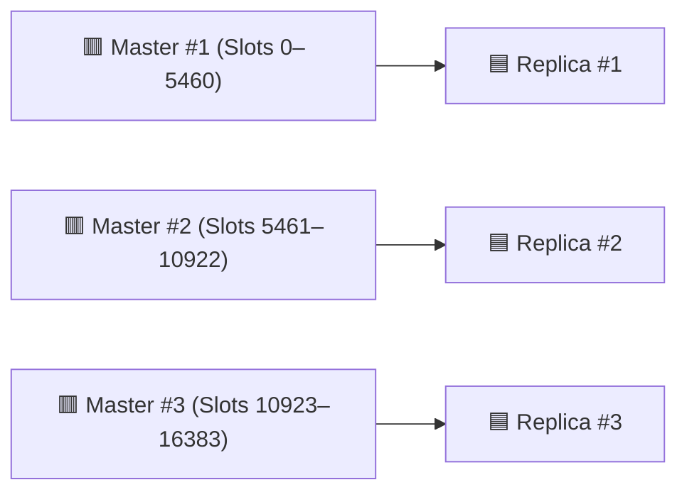

  

    
    
    
    
    
   
  

   

   
<b>A complete, ready-to-run Redis Sentinel & Cluster playground with Docker Compose for   learning, testing, and deploying Redis in real-world scenarios.</b>

## 📝 Overview

This project provides a **hands-on Redis lab** that covers both **Sentinel** and **Cluster** modes:

- ⚡ **Redis Sentinel** → High Availability & Automatic Failover
- 📦 **Redis Cluster** → Sharding + High Availability

🎯 **Goal**: Help developers, DevOps, and students **experiment, validate, monitor, and integrate Redis** into production-like environments.

## ✨ Features

- [x] Quick Bootstrap – Start Sentinel & Cluster in seconds with Docker Compose
- [x] Automation Scripts – Health checks, failover tests, backups, slot rebalancing
- [x] Monitoring Stack – RedisInsight, Redis Commander, Prometheus, Grafana, Alerts (Slack/Email/Telegram)
- [x] CI/CD Ready – GitHub Actions/GitLab CI for automated testing & deployment
- [x] Real-World Demos – Integration with Node.js, Python, Java, Go, etc. (caching, pub/sub, queues, sessions)
- [x] Advanced Guides – Kubernetes (Helm, StatefulSet, Operator), Cloud Backup/Restore, TLS/Security

## 👤 Who Is This For?

- 👨‍💻 Backend Developers – Learn caching, pub/sub, queues, session storage
- 🛠️ DevOps / SREs – Practice HA, failover recovery, monitoring, scaling
- 🎓 Students / Learners – Experiment with Redis concepts in a safe sandbox
- 🏗️ System Architects – Validate Redis as a distributed system building block

## 🏗️ Architecture

### 🔹 Sentinel Mode (HA + Failover)

### 🔹 Cluster Mode (Sharding + Replication)

## 🤝 Contributing

We welcome contributions! Please see our [Contributing Guidelines](.github/CONTRIBUTING.md) for details.

💡 Fork → Hack → Test → PR.
Bug reports & feature requests welcome in [Issues](https://github.com/thuongtruong109/reluster/issues).

We invite you to contribute and help improve Reluster 💚

Here are a few ways you can get involved:

- **🐛 Reporting Bugs:** If you come across any bugs or issues, please check out the [reporting bugs guide](https://github.com/thuongtruong109/reluster/issues) to learn how to submit a bug report.
- **✨ Suggestions:** Have ideas to enhance features? We'd love to hear them! Check out the [contribution guide](.github/CONTRIBUTING.md) to share your suggestions.
- **❓ Questions:** If you have questions or need assistance, open [discussions](https://github.com/thuongtruong109/reluster/discussions) or join our to connect with other users and contributors.

## 📝 License

Distributed under the [Apache 2.0](LICENSE) license. Copyright (c) 2025 Thuong Truong.

<!-- https://medium.com/@jielim36/basic-docker-compose-and-build-a-redis-cluster-with-docker-compose-0313f063afb6 -->
<!-- https://dev.to/hedgehog/set-up-redis-diskless-replication-359 -->
<!--  -->
